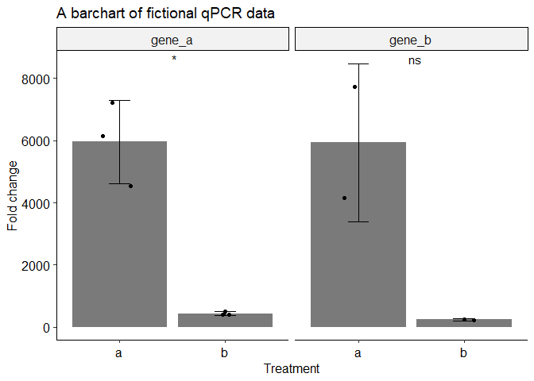

qPCR analysis workflow
================

Run the code chunk below to load the required packages. (code is not
shown after knitting to html)

Run the code below to activate the functions. (code is not shown after
knitting to html)

# Preparation

Open rstudio. Make a new project by clicking file \> new project \> new
directory \> new project \> give it a logical name and location.

# Preparing data in excel

## Step 1: Check the curves

Look at all the curves at the qPCR machine. Note the wells with weirdly
shaped curves. Exclude those from the analyses (but don’t modify the raw
data files\!)

## Step 2: Manual labour

Copy \> paste all raw data into an excel file. Do this in a [tidy
format](https://r4ds.had.co.nz/tidy-data.html). This means each
measurement (Cq value) has its own row, and every experimental variable
has it’s own column. Also include a column for the genes that were the
target of your PCR and for technical replicate number (i.e. 1,2,3).

## Step 3: Clean up

Delete all Cq values that had weird curves, as noted in step 1.

## Step 4: Save

Save the excel file as a .csv file. Save it inside the folder you just
created for this r project. Now you don’t have to use setwd()\! And if
you send your r project to a collaborator, they also don’t need to use
setwd()\!

# Analyses in R

## Importing data

If you closed rstudio in the meantime, start it and open the project
created for this analysis.

Depending on your computer settings, the column separator can either be
either a comma or a semicolon. Furthermore, the decimal point separator
may be either a dot or a comma. You can check this by opening the csv
file in a program like notepad. Alternatively, just try to load the data
and see what happens. Here’s when to use which function:

  - comma delimited, dot as decimal point \> use `read_csv(file =
    "yourfile.csv")`
  - semicolon delimited, comma as decimal point \> use `read_csv2(file =
    "yourfile.csv")`
  - semicolon delimited, dot as decimal point \> use `read_delim(file =
    "yourfile.csv", delim = ";")`

Note: these function are from the readr package, which is part of the
tidyverse. They are faster and more reproducible than their base r
equivalent. To learn more go
[here](https://r4ds.had.co.nz/data-import.html).

In this example we will use some randomly generated data. It contain Cq
values for three genes: gene\_a, gene\_b and gene\_hk (hk =
housekeeping). There are also three treatment conditions: a, b and ctrl.
ctrl is the untreated control. Three biological replicates were
performed.

``` r
raw_data <- read_delim(file = "rawcqvalues.csv", delim = ";") # see above for which function to use if you use your own file. 
```

It’s always a good idea to have a quick look at the imported data. Check
if the columns are separated correctly. Check if the decimal point is at
the right place.

| treatment | bio\_rep | tech\_rep | primer\_pair | cq\_values |
| :-------- | -------: | --------: | :----------- | ---------: |
| ctrl      |        1 |         1 | gene\_a      |         NA |
| ctrl      |        1 |         2 | gene\_a      |       35.0 |
| ctrl      |        1 |         3 | gene\_a      |         NA |
| ctrl      |        2 |         1 | gene\_a      |       34.9 |
| ctrl      |        2 |         2 | gene\_a      |       34.3 |

First 5 rows of the raw data

## Cleaning the data

The function `qpcr_clean()` removes outliers from technical qPCR
replicates. These outliers can occur thru inaccurate pipetting,
pipetting in the wrong well, seal detachment, etc. The function removes
them based on the deviation from the median value, using the following
rules:

  - If only one Cq value is present (i.e. the other replicates failed to
    produce a Cq value), it will be removed.
  - If only two Cq values are present, they need to be less than a
    threshold apart.
  - For three or more technical replicates:
      - If the absolute distance between a Cq value and the median Cq is
        greater than a set threshold, than this value will be removed.
      - If all Cq values within a technical replicate are more than a
        threshold apart, they will all be removed.

Function arguments:

  - The first argument is name of the data you want to use.
  - `cq =` tells the function the name of the column containing the Cq
    values.
  - `threshold =` sets the maximum deviation from the median value.
  - Finally, the function needs the names of all other columns that are
    not the cq\_values or denote technical replicates. These will be
    used to make groups, so calculations will be made for each unique
    combination of treatment, primer\_pair and bio\_rep in this example.
    Give them unquoted and separated by a comma.

<!-- end list -->

``` r
clean_data <- qpcr_clean(raw_data, cq = cq_values, threshold = 1, treatment, primer_pair, bio_rep)
```

``` r
outliers <- raw_data %>%
  setdiff(clean_data)
```

The following table contains all removed outliers and missing values:

| treatment | bio\_rep | tech\_rep | primer\_pair | cq\_values |
| :-------- | -------: | --------: | :----------- | ---------: |
| ctrl      |        1 |         1 | gene\_a      |         NA |
| ctrl      |        1 |         2 | gene\_a      |       35.0 |
| ctrl      |        1 |         3 | gene\_a      |         NA |
| a         |        1 |         2 | gene\_a      |       25.0 |
| b         |        1 |         3 | gene\_a      |       20.0 |
| ctrl      |        1 |         2 | gene\_b      |         NA |
| a         |        2 |         1 | gene\_b      |       18.0 |
| a         |        2 |         2 | gene\_b      |       22.3 |
| a         |        2 |         3 | gene\_b      |       27.0 |
| b         |        1 |         1 | gene\_b      |       26.0 |
| b         |        1 |         2 | gene\_b      |       24.0 |
| b         |        1 |         3 | gene\_b      |         NA |

If most outliers are from a specific biological replicate, than this is
an indication that there is something wrong with that specific
experiment. If most outliers are the first or third technical replicate,
it could indicate problems with seal attachment at the edge of your qPCR
plate, depending on your plate design.

For context, you might want to see the other Cq values within a
technical replicate that contains an outlier. That’s what the
`qpcr_outlier_context()` function is for.

Function arguments:

  - `raw_data =` Here you supply the raw unfiltered data
  - `clean_data =` Here you supply the cleaned data from the
    `qpcr_clean()` function
  - `cq_values =` Give name of the column containing the cq values
  - `tech_rep =` Give the name of the column containing the technical
    replicate information
  - All other column names, excluding the columns containing the Cq
    values or technical replicates. Give them unquoted and separated by
    a comma.

<!-- end list -->

``` r
outlier_triplets <- qpcr_outlier_context(raw_data = raw_data, 
                                         clean_data = clean_data, 
                                         cq_values = cq_values, 
                                         tech_rep = tech_rep, 
                                         treatment, bio_rep, primer_pair)
```

``` r
opts <- options(knitr.kable.NA = "")
knitr::kable(
  outlier_triplets)
```

| treatment | bio\_rep | primer\_pair | tech\_rep | cq\_values | outlier |
| :-------- | -------: | :----------- | --------: | ---------: | :------ |
| ctrl      |        1 | gene\_a      |         1 |            | TRUE    |
| ctrl      |        1 | gene\_a      |         2 |       35.0 | TRUE    |
| ctrl      |        1 | gene\_a      |         3 |            | TRUE    |
| a         |        1 | gene\_a      |         1 |       21.7 |         |
| a         |        1 | gene\_a      |         2 |       25.0 | TRUE    |
| a         |        1 | gene\_a      |         3 |       22.3 |         |
| b         |        1 | gene\_a      |         1 |       25.3 |         |
| b         |        1 | gene\_a      |         2 |       25.5 |         |
| b         |        1 | gene\_a      |         3 |       20.0 | TRUE    |
| ctrl      |        1 | gene\_b      |         1 |       35.1 |         |
| ctrl      |        1 | gene\_b      |         2 |            | TRUE    |
| ctrl      |        1 | gene\_b      |         3 |       35.6 |         |
| a         |        2 | gene\_b      |         1 |       18.0 | TRUE    |
| a         |        2 | gene\_b      |         2 |       22.3 | TRUE    |
| a         |        2 | gene\_b      |         3 |       27.0 | TRUE    |
| b         |        1 | gene\_b      |         1 |       26.0 | TRUE    |
| b         |        1 | gene\_b      |         2 |       24.0 | TRUE    |
| b         |        1 | gene\_b      |         3 |            | TRUE    |

## Averaging technical replicates

Now it is time to take the average of the Cq values within all the
remaining technical replicates. We will do this with the
`qpcr_avg_techrep()` function. The column containing this average will
be called `cq`.

Function arguments:

  - The name of your (cleaned) dataset
  - `cq =` the name of the column containing the Cq values
  - All other column names, excluding the columns containing the Cq
    values or technical replicates. Give them unquoted and separated by
    a comma.

Check the table to see if it worked:

``` r
avg_data <- qpcr_avg_techrep(clean_data, cq = cq_values, treatment, primer_pair, bio_rep)
```

| treatment | primer\_pair | bio\_rep |       cq |
| :-------- | :----------- | -------: | -------: |
| a         | gene\_a      |        1 | 22.00000 |
| a         | gene\_a      |        2 | 21.63333 |
| a         | gene\_a      |        3 | 21.60000 |
| a         | gene\_b      |        1 | 22.13333 |
| a         | gene\_b      |        3 | 22.20000 |
| a         | gene\_hk     |        1 | 19.30000 |

The first six rows of the average Cq values

At this point I like to make some exploratory plots. Check if your
housekeeping gene is indeed stable. Maybe you can already see if your
experimental genes look promising.

``` r
ggplot(data = avg_data, aes(x = treatment, y = cq))+  #replace x to you situation
  geom_point()+
  facet_wrap(~primer_pair) #replace as needed
```

<!-- -->

## Calculate dCq values

The `qpcr_dcq()` function subtracts the housekeeping gene Cq values from
the experimental genes Cq values.

Function arguments:

  - The name of the dataset containing the average Cq values.
  - `cq =` give the name of the column containing the (averaged) Cq
    values. If you used the `qpcr_avg_techrep()` function this column is
    called `cq`.
  - `primer_pair =` supplies the name of the column that denotes which
    gene was the target of the PCR.
  - `housekeeping =` give the value of your housekeeping gene, in
    quotes, as it occurs in your primer\_pair column.
  - All other column names excluding columns for: cq values, technical
    replicates and primers used.

<!-- end list -->

``` r
dcq_values <- qpcr_dcq(avg_data, cq = cq, primer_pair = primer_pair, housekeeping = "gene_hk", treatment, bio_rep)
```

| treatment | primer\_pair | bio\_rep |       cq |   cq\_hk |      dcq |
| :-------- | :----------- | -------: | -------: | -------: | -------: |
| a         | gene\_a      |        1 | 22.00000 | 19.30000 | 2.700000 |
| a         | gene\_a      |        2 | 21.63333 | 19.16667 | 2.466667 |
| a         | gene\_a      |        3 | 21.60000 | 18.46667 | 3.133333 |
| a         | gene\_b      |        1 | 22.13333 | 19.30000 | 2.833333 |
| a         | gene\_b      |        3 | 22.20000 | 18.46667 | 3.733333 |
| b         | gene\_a      |        1 | 25.40000 | 18.73333 | 6.666667 |

The first six rows of the dCq values

Again we can make some intermediate plots.

``` r
dcq_values %>%
  ggplot(aes(treatment, dcq))+ # replace treatment with whatever you used
    geom_point()+
    facet_grid(cols = vars(primer_pair)) #use if you pcr multiple genes
```

<!-- -->

## Calculating ddCq values

The function `qpcr_ddcq` subtracts the dCq control from the dCq
treatments. It also calculates the fold change.

Function arguments:

  - The dataset containing the dCq values.
  - `dcq =` give the name of the column containing the dCq values. If
    you used the `qpcr_dcq()` function to create the dataset you don’t
    need to use this argument.
  - `treatment =` tells the function the name of the column containing
    the treatment information. This function cannot deal with multiple
    treatment variables yet, for example if you have different additives
    and timepoints\! In this case I would calculate the ddCq for each
    additive separately. Use `A_data <- filter(data, additive == "A")`
    to create separate datasets.
  - `untreated =` give the value in the treatment column that
    corresponds with you untreated control samples.
  - `primer_pair` give the column name of the column that indicates
    which genes were targeted for PCR.

<!-- end list -->

``` r
ddcq_values <- qpcr_ddcq(dcq_values, treatment = treatment, untreated = "ctrl", primer_pair = primer_pair)
```

| treatment | primer\_pair | bio\_rep |       cq |   cq\_hk |      dcq | dcq\_ctrl |        ddcq | fold\_change |
| :-------- | :----------- | -------: | -------: | -------: | -------: | --------: | ----------: | -----------: |
| a         | gene\_a      |        1 | 22.00000 | 19.30000 | 2.700000 |  15.28333 | \-12.583333 |    6137.0658 |
| a         | gene\_a      |        2 | 21.63333 | 19.16667 | 2.466667 |  15.28333 | \-12.816667 |    7214.4148 |
| a         | gene\_a      |        3 | 21.60000 | 18.46667 | 3.133333 |  15.28333 | \-12.150000 |    4544.7966 |
| a         | gene\_b      |        1 | 22.13333 | 19.30000 | 2.833333 |  15.75000 | \-12.916667 |    7732.2184 |
| a         | gene\_b      |        3 | 22.20000 | 18.46667 | 3.733333 |  15.75000 | \-12.016667 |    4143.5932 |
| b         | gene\_a      |        1 | 25.40000 | 18.73333 | 6.666667 |  15.28333 |  \-8.616667 |     392.5321 |

The first six rows of the ddCq values

## All in one

It is also possible to chain all the functions together using the
[pipe](https://r4ds.had.co.nz/pipes.html). This is the fastest way to do
it, but you will miss all the intermediate data.

``` r
ddcq_values <- raw_data %>%
  qpcr_clean(cq = cq_values, threshold = 1, treatment, primer_pair, bio_rep) %>%
  qpcr_avg_techrep(cq = cq_values, treatment, primer_pair, bio_rep) %>%
  qpcr_dcq(cq = cq, primer_pair = primer_pair, housekeeping = "gene_hk", treatment, bio_rep) %>%
  qpcr_ddcq(treatment = treatment, untreated = "ctrl", primer_pair = primer_pair) 
ddcq_values
```

    ## # A tibble: 10 x 9
    ##    treatment primer_pair bio_rep    cq cq_hk   dcq dcq_ctrl   ddcq fold_change
    ##    <chr>     <chr>         <dbl> <dbl> <dbl> <dbl>    <dbl>  <dbl>       <dbl>
    ##  1 a         gene_a            1  22    19.3  2.70     15.3 -12.6        6137.
    ##  2 a         gene_a            2  21.6  19.2  2.47     15.3 -12.8        7214.
    ##  3 a         gene_a            3  21.6  18.5  3.13     15.3 -12.1        4545.
    ##  4 a         gene_b            1  22.1  19.3  2.83     15.8 -12.9        7732.
    ##  5 a         gene_b            3  22.2  18.5  3.73     15.8 -12.0        4144.
    ##  6 b         gene_a            1  25.4  18.7  6.67     15.3  -8.62        393.
    ##  7 b         gene_a            2  25.2  18.9  6.3      15.3  -8.98        506.
    ##  8 b         gene_a            3  25.5  18.8  6.63     15.3  -8.65        402.
    ##  9 b         gene_b            2  26.9  18.9  8        15.8  -7.75        215.
    ## 10 b         gene_b            3  26.6  18.8  7.73     15.8  -8.02        259.

## Plotting

Very common for qPCR data is a barchart with errorbars and the actual
data as points. Including the data points is
[important](https://journals.plos.org/plosbiology/article?id=10.1371/journal.pbio.1002128)\!
For the bar and the errorbars we have to calculate some summary
statistics first. We can then call upon the summary data inside the
geoms. The `qpcr_summary()` function calculates the mean and standard
deviation.

Function arguments:

  - The dataset you want to summarise, in this case the ddCq values.
  - `to_summarise =` The column you want to apply the function to, for
    example the fold change values.
  - The variables you want to group your data by. In this example we
    want a mean and sd for every unique treatment and primer\_pair
    combination.

<!-- end list -->

``` r
#calculate mean and standard deviation
summary <- qpcr_summary(ddcq_values, to_summarise = fold_change, treatment, primer_pair)

#making the barchart
ddcq_values %>%
  ggplot(aes(treatment, fold_change))+  #replace treatment with your column name.
    geom_bar(data = summary, aes(treatment, mean), stat = "identity", alpha = 0.8)+ #replace treatment with your column name.
    geom_errorbar(data = summary, aes(treatment, mean, ymin = mean-sd, ymax = mean+sd), #replace treatment with your column name.
                  width = 0.2)+
    geom_jitter(width = 0.2)+
    facet_grid(cols = vars(primer_pair))+ #replace primer_pair with your column name.
    stat_compare_means(label = "p.signif", method = "t.test", label.x = 1.5, show.legend = FALSE)+
    theme_pubr()+ # this theme is supposed to be publication ready
    theme(strip.text = element_text(size = 12))+ 
    labs(x = "Treatment",  #set the axis labels and title
         y = "Fold change",
         title = "A barchart of fictional qPCR data")
```

<!-- -->
